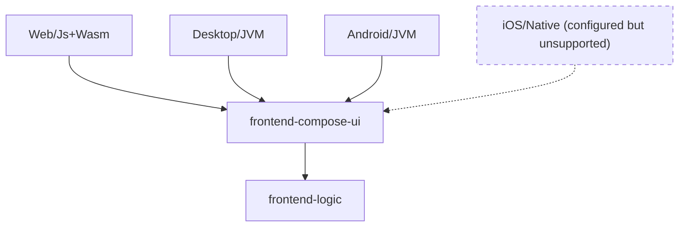

# Frontend

For Human Contributors: You need to follow this [guide](https://www.jetbrains.com/help/kotlin-multiplatform-dev/multiplatform-setup.html#check-your-environment) to set up the Compose Multiplatform development environment.

The frontend targets Android, Desktop, and Web (in both Kotlin/JS and Kotlin/wasmJs). The iOS platform is configured in Gradle source sets, but remains explicitly unsupported and unverified at runtime.

## Structure

The [`conduit-frontend`](../../conduit-frontend) module is divided into several modules:

- [`frontend-logic`](../../conduit-frontend/frontend-logic): The shared business logic, MVIKotlin stores/reducers, navigation state, and native AndroidX/CMP ViewModels. Free of Compose UI dependencies.
- [`frontend-compose-ui`](../../conduit-frontend/frontend-compose-ui): The Compose Multiplatform UI implementation using Navigation 3 scenes, adaptive layouts, and entry-scoped ViewModels.
- [`app-android`](../../conduit-frontend/app-android): The Android app entry point and Activity hosting.
- [`app-desktop`](../../conduit-frontend/app-desktop): The Desktop app entry point and window lifecycle management.
- [`app-web`](../../conduit-frontend/app-web): The Web app entry point (JS/WasmJs) with asynchronous initialization and native ComposeViewport lifecycle.

## Architecture Diagram



## Testing & Verification Commands

`conduit-frontend` includes comprehensive test suites covering all supported targets:

### Four-Target Logic Tests (`frontend-logic`)

From the `conduit-frontend` directory, run individual target suites:

```bash
# JVM target test suite
./gradlew :frontend-logic:jvmTest

# Android target host suite (Robolectric SDK 35, no emulator required)
./gradlew :frontend-logic:testAndroidHostTest

# Kotlin/JS browser suite (Chromium headless)
./gradlew :frontend-logic:jsBrowserTest

# Kotlin/WasmJs browser suite (Chromium headless)
./gradlew :frontend-logic:wasmJsBrowserTest
```

### UI Tests (`frontend-compose-ui`)

Runs Navigation 3 scene tests, resize ownership verification, and desktop SavedState handoff checks:

```bash
./gradlew :frontend-compose-ui:jvmTest
```

### All Tests in One Command

```bash
./gradlew :frontend-logic:jvmTest :frontend-logic:testAndroidHostTest :frontend-logic:jsBrowserTest :frontend-logic:wasmJsBrowserTest :frontend-compose-ui:jvmTest
```

Tests on the JS and Wasm platforms require Chromium/Chrome. The convention plugin uses `useChromiumHeadless()` locally.
