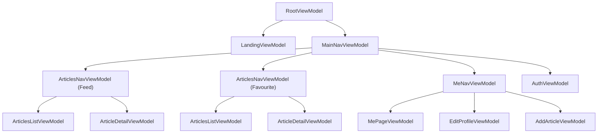

# Frontend Logic

The `frontend-logic` module serves as the core business logic, navigation state coordination, and ViewModel layer for the frontend. It is completely decoupled from Compose UI, ensuring that logic can be tested without graphical dependencies and can support all multiplatform targets.

## Navigation & ViewModel Hierarchy

## Architecture Principles

1. **Pure Kotlin Multiplatform**: Free of Compose UI dependencies. Compiles for JVM, Android, JS, and WasmJs targets.
2. **Native AndroidX / CMP ViewModels**: Every screen and navigation coordinator is implemented as a native `ViewModel`.
3. **MVIKotlin Business Stores**: Stores, reducers, and executors manage business states and asynchronous side effects.
4. **Assisted Factory Classes**: Factories are plain singleton classes (e.g., `LandingViewModelFactory`, `MainNavViewModelFactory`, `ArticlesNavViewModelFactory`), not interfaces. Their constructors receive singleton dependencies resolved inside the DI module (via Koin constructor injection in `component/di.module.kt`), and their `create(...)` methods accept dynamic runtime parameters (such as `SavedStateHandle`, navigators, or search filters).
5. **Strict DI Encapsulation Rule**:
   - All Koin DI module definitions and container resolutions must reside strictly inside `di.module*.kt` files (e.g., `di.module.kt`, `di.module.android.kt`, `di.module.web.kt`, `di.module.desktop.kt`).
   - No DI framework symbols, annotations, or direct container lookups are permitted in ordinary logic, ViewModel, UI, or test files.
   - Platform entry points and UI hosts receive dependencies exclusively through the plain `AppDependencies` container.

## Navigation Topologies & State Preservation Rules

- **Root Gating from KStore**: `RootViewModel` observes `UserConfigKStore`. When a valid server URL is configured, it transitions from the Landing screen to `MainNav`.
- **Interactive Navigation with MVIKotlin**: Interactive navigation is managed by MVIKotlin stores (`MainNavStore`, `ArticlesNavStore`, `MeNavStore`).
- **Authoritative Auth Wins**: Current auth/server credentials always take precedence. If authentication state changes, restored navigation states reconcile against current account status.
- **Tab Replacement Lifecycle**: Switching top-level tabs destroys the prior tab's child route tree. Incrementing the `generation` counter on `MainChildRoute` assigns distinct entry identities across rapid tab switches, ensuring the replaced route tree is disposed.
- **No Saved Form Caches**: Form inputs, unsaved article drafts, and passwords do not persist across tab switching or process death.
- **Synchronous Navigation Labels**: One-off navigation events are emitted as labels by the business store, synchronously subscribed by the owning leaf ViewModel during initialization, and forwarded to the parent navigation coordinator (e.g., `ArticlesNavViewModel`, `MeNavViewModel`).
- **ArticlesNav Constraints**: Feed and Favourite flows enforce a strict 1-2 entry stack constraint (`List` or `List + Detail`). Selecting an already open article is a no-op; selecting a different article replaces the detail entry; closing an article requires a matching entry ID to guard against stale events; the root list can never be popped.
- **MeNav Flows**: Manages user profile display (`MePageViewModel`), profile editing (`EditProfileViewModel`), and article creation (`AddArticleViewModel`).
- **SavedState Recreation Scope**: Serializable snapshot classes (`ArticlesNavSavedSnapshot`, `MeNavSavedSnapshot`, etc.) support Android Activity recreation and process death. Cold-start restoration on Desktop and Web is explicitly out of scope.

## Testing Patterns

### MVIKotlin Store & ViewModel Testing

- **Naming**: Test classes end with `Test` (e.g., `ArticlesListStoreTest`, `ArticlesNavViewModelTest`).
- **Mocking**: Mock services using `dev.mokkery`, configuring stubs with `everySuspend` and asserting with `verifySuspend`.
- **Dispatchers**: Use `StandardTestDispatcher` for deterministic coroutine progression.
- **Cleanup**: Teardown is performed via the owning `ViewModelStore.clear()` (which invokes `onCleared()` on managed ViewModels) or `store.dispose()`. `ViewModel` does not expose a public `clear()` method.
